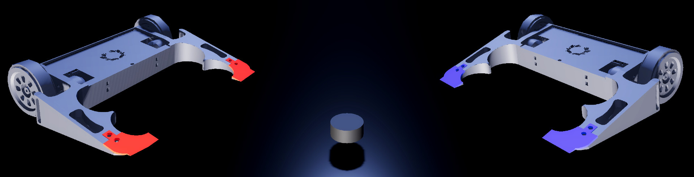

<div align="center">


Hockey de robôs. Local multiplayer de 1v1 até 3v3.

<a href="https://eduardo-barreto.github.io/arena-hockey/"><strong>Jogar no navegador</strong></a>
</div>

---

## Controles

| Robô | Frente | Trás | Esquerda | Direita |
|------|--------|------|----------|---------|
| Vermelho 1 | W | S | A | D |
| Azul 1 | Setas | Setas | Setas | Setas |

Mais robôs e teclas são configuráveis no menu de pausa (**ESC**).

**R** reseta o puck.

## Rodar localmente

```bash
git clone https://github.com/Eduardo-Barreto/ArenaHockey.git
```

Abra `arena-hockey/project.godot` no Godot 4.6+.
